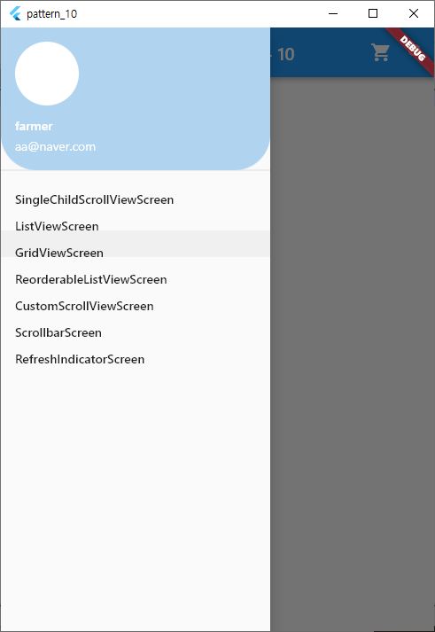

# pattern_10 실행 화면 및 주요 소스 내용


## 1. 메뉴 구성을 위한 모델 생성
```dart
  class ScreenModel {
    final WidgetBuilder builder;
    final String name;
  
    ScreenModel({
      required this.builder,
      required this.name,
    });
  }
```

## 2. dart화면목을 List 변수에 담기
```dart
  final screens = [
    ScreenModel(builder: (_) => DartClassName1(), name: '메뉴한글명 1'),
    ScreenModel(builder: (_) => DartClassName2(), name: '메뉴한글명 2'),
    ScreenModel(builder: (_) => DartClassName3(), name: '메뉴한글명 3'),
    ScreenModel(builder: (_) => DartClassName4(), name: '메뉴한글명 4'),
  ];
```

## 3. drawer에 List 연동하기
```dart
drawer: Drawer(
        child: ListView(
          children: screens
                .map((screen) => createLeftOneMenu(
                      context,
                      screen.builder,
                      screen.name,
                    )).toList()
        ),
      ),
```

```dart
  Widget createLeftOneMenu(BuildContext context, WidgetBuilder builder, String menuNm) {
    return TextButton(
      style: const ButtonStyle(alignment: Alignment.centerLeft),
      onPressed: () {
        Navigator.of(context).push(
          MaterialPageRoute(builder: builder),
        );
      },
      child: Text(menuNm, style: const TextStyle(fontWeight: FontWeight.w400, color: Colors.black),
      ),
    );
  }
```


