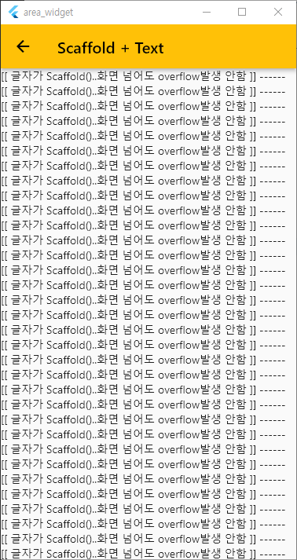

# 1. Overflow
### Widget overflow 및 size 특징 분류
 > 첫번째, child Widget들의 size가 커지면 scroll이 되거나, 안보이는 Widget들이 있다. overflow발생안함.<br>
 > 두번째, child Widget들의 size가 화면보다 커지면 같이 커지는 Widget들이 있다. overflow발생.<br>
 > 세번째, 위 두가지는 Widget본인의 성격에 의해 정해진 특징이다.<br>
 >        하지만 본인 성격도 중요하지만 Parent Widget성격에 따라가는 경우도 있다.<br>
 >        즉, parent가 overflow발생할 수 있는 Widget이면 child가 scroll기능이 있어도 overflow가 발생한다.<br>

### Overflow에 따른 Widget 분류 
|절대 발생하지 않는  Widget |하위 Widget Size에 따라서 결정|상위Widget에 따라서 달라지는 Widget|
|-------------------------|-----------------------------|---------------------------------|
| Scaffold                | Row                         |                                   |
| Expanded                | Column                      | 왼쪽 widget들 제외한 모든 Widget(?) |
| Flexible                | Flex (?)                    | Text, Container, SizedBox ...    |

| 분류 | 정의 |
|-------------------------|-----------------------------|
|절대 발생하지 않는  Widget          | Parent, Child에 어떤 Widget들이 와도 overflow발생 안함 |
|하위 Widget Size에 따라서 결정      | 하위 Widget들의 Size가 화면보다 커질 경우 overflow발생 |
|/상위Widget에 따라서 달라지는 Widget | 1.상위 Widget이 '절대 발생하지 않는 Widget'들이면 overflow발생 안함 |
|^                                  |  2.상위 Widget이 '하위 Widget Size에 따라서 결정'되는 Widget들이면 overflow발생 함 |

### Overflow에 예제
 - Scaffold + (Text or Container or SizedBox, Row, Column ... ) : 정상
 - Expanded + (Text or Container or SizedBox, Row, Column ... ) : 정상
 - Flexible + (Text or Container or SizedBox, Row, Column ... ) : 정상

 - (Row,Column,Flex) + (Expanded, Flexible) : 정상
 - <pre>Row               + (Text or Container or SizedBox ... ) : 오류</pre>
 - <pre>Column            + (Text or Container or SizedBox ... ) : 오류</pre>
 - <pre>Flex              + (Text or Container or SizedBox ... ) : 오류</pre>

### Overflow Widget들 찾아 내는 방법
 - 1. Scaffold 하위에 child로 배치 하여, Size를 overflow하도록 설정 한다.
 - 2. (Row,Column,Flex) 하위에 children로 배치 하여, Size를 overflow하도록 설정 한다.

# 2. Scaffold + Text 예문
 - Scaffold child에는 어떤 Widget이 와도 overflow가 발생하지 않는다.
 - scroll 되는  Widget은 아니다.

 - Scaffold + Text
 > Scaffold 안에 Text를 overflow가 발생하도록 넣어 본다. 하지만 발생하지 않는다.<br>
 > Scaffold는 자체적으로 scroll기능은 없지만, child Widget의 최대 size보다 커지지는 않는다.<br>

```dart
  return Scaffold(
    appBar: AppBar(title: const Text("Scaffold + Text")),
    body: Text('[[ 글자가 Scaffold()..화면 넘어도 overflow발생 안함 ]] ------' * 1000),
  );
```
 - 실행결과 : 정상


 - Scaffold + Text 참고소스
 > https://github.com/farmerkyh/flutter_widget_template/blob/master/area_widget/lib/overflow/scaffold_text_100.dart

# 1. Scffold + Column + ListView 예문
```dart
  body: Column(
    children: [
      ListView.builder(
          itemCount: 40,
          itemBuilder: (BuildContext context, int index) {
            return Text("item - $index");
          }),
    ],
  ),
```
 - 실행결과
 > The following assertion was thrown during performResize.<br>
 > Vertical viewport was given unbounded height.<br>
 > (세로 뷰포트에 제한 없는 높이가 지정되었습니다.)<br>
 
 - 이유
 > Column 특징 : Column문서 확인<br>
 > https://github.com/farmerkyh/flutter_widget_template/blob/master/area_widget/README.md<br>
 > 기본적으로 ListView는 Scaffold child로 사용 시 자동 scroll 되어 overflow 오류가 나지 않는다. <br>
 > 하지만 Column children으로 ListView가 포함 될 경우에는 Column Widget의 특성에 종속 된다.<br>

# 2. Scffold + Container + ListView 예문
```dart
  body: Container(
    child: ListView.builder(
        itemCount: 40,
        itemBuilder: (BuildContext context, int index) {
          return Text("item - $index");
        }),
  ),
```

 - 정상작동
 - 이유 : Container특성 때문
 > https://github.com/farmerkyh/flutter_widget_template/blob/master/area_widget/README.md

# 3. Scffold + SizedBox + ListView  예문
```dart
  body: SizedBox(
    child: ListView.builder(
        itemCount: 40,
        itemBuilder: (BuildContext context, int index) {
          return Text("item - $index");
        }),
  ),
```
 - 정상작동
 - 이유 : SizedBox특성 때문
 > https://github.com/farmerkyh/flutter_widget_template/blob/master/area_widget/README.md

# 4. Scffold + Expanded 예문
```dart
  return Scaffold(
    appBar: AppBar(title: const Text("Expanded + ListView")),
    body: Expanded(
      child: Text('10000' * 1000),
    ),
  );
```
 - 오류 (overflow와 관련없이 Expanded 특성상 오류임)
 - 이유 : Expanded특성 때문
 > https://github.com/farmerkyh/flutter_widget_template/blob/master/area_widget/README.md

# 5. Column + Expanded 예문
```dart
  body: Column(
    children: [
      Expanded(
        child: Container(color: Colors.blue, child: Text('첫번째 Expanded--- 100번' * 100)),
      ),
      Expanded(child: Text('두번째 Expanded--- 200번' * 200)),
      Expanded(
        child: Container(color: Colors.amber, child: Text('세번째 Expanded--- 300번' * 200)),
      ),
    ],
  ),
```

 - 정상
 - 이유 : Expanded특성 때문
 > https://github.com/farmerkyh/flutter_widget_template/blob/master/area_widget/README.md

 - 실행결과 : 정상


