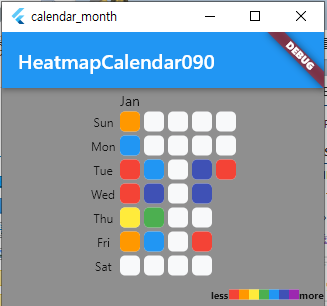
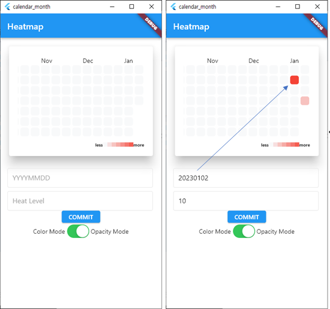
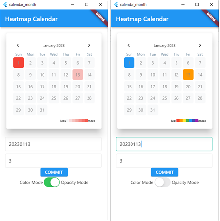
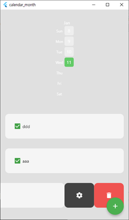
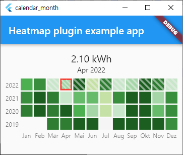

# Heatmap, fl_Heatmap  Calendar

## 1. 소스명 : heatmap_calender_090.dart
1. 개발정의
 - 가장간단한 소스.
 - 당월 01 ~ 말일까지 화면에 표시
 - 특정일자를 클릭 하면  해당일자에 color 적용
2. 실행화면   
 

## 2. 소스명 : heatmap_calender_100.dart
 - 실행화면   
 

## 3. 소스명 : heatmap_calender_110.dart
 - 실행화면   
 

## 50. 소스명 : heatmap_calender_500.dart
 - 실행화면   
 

## 99. 소스명 : fl_heatmap_calendar_100.dart
 - 실행화면   
 

