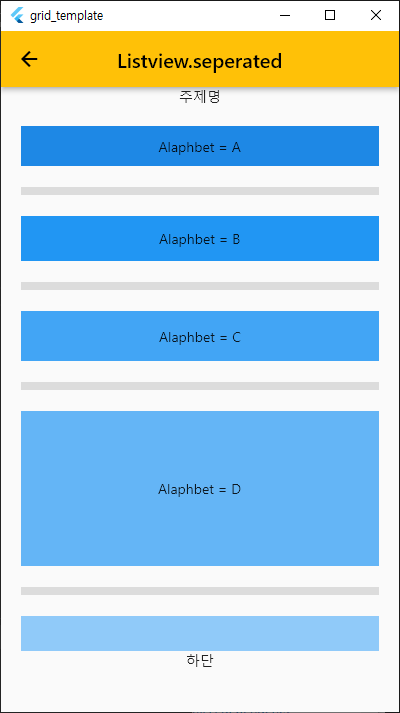

# ListView Template

### 1. 정의

### 2. ListView 5가지 생성 방법
   - ListView
   - ListView.builder
   - ListView.separated
   - ListView.custom

### 3. ListView vs ListView.builder
#### 공통점
 - 스크롤이 가능한 배열형 위젯.

#### 다른점:
 - ListView: 위젯이 생성될 때 리스트뷰안의 차일드 widget을 모두 생성해서 보여준다. 
             그래서 소수의 차일드를 가질 경우 쓰는것이 적정하다
             (예, 메뉴리스트)
 - ListView.Builder: 이 위젯은 LazyList(란?)방식이다. 
    화면에 보여주는 영역만큼만 파일을 저장소나 서버에서 불러와 widget을 생성하여 보여준다.
    그러므로 다량의 파일을 불러올 때 이것을 쓰면 좋다. 
    이스타그램을 실행했을 때 전세계인의 모든 피드를 불러온다면 모바일폰은 폭발할 것이다. 
    하지만 이 위젯을 쓰면 보는 부분만 파일들을 불러오기 때문에 콜을 효율적으로 할 수 있다.

###4. ListView
 - List형태로 scroll되는 widget이다.
 - builder, separated와 같이 count,length 개념이 없다.
 - ListView(children:[Text('a'), Text('b'), Text('b')]) 와 같이 보여주고 싶은 Widget을 모두 나열한다.

###4. ListView.builder
 

###4. ListView.separated
        //----------------------------------------------------------------------------------------------
        //1. ListView
        //   - .separated       . 라인별 구분라인이 그린다.
        //   - separatorBuilder . 구분라인을 그릴때 option
        //                      . Divider(thickness):구분라인이 두꺼워진다고 해서 자동으로 구분간격도 늘어나지는 않는다.
        //                      . Divider(height)   : List 라인별 사이의 간격
        //   - itemCount . 해당 숫만큼 itemBuilder 를 수행 한다.
        //   - padding   . ListView와 item list 사이의 간격
        //2. Expanded
        //   - 남은 간격을 n분의1로 크기 설정
        //   - flex : Expanded 가 여러 개 일 경우 각각의 height 비율을 지정할 수 있다.
        //----------------------------------------------------------------------------------------------
 

###4. ListView.custom
```dart
    child: ListView.custom(
        childrenDelegate: SliverChildBuilderDelegate((BuildContext context, int index) {
            return Widget();
        },
        childCount: items.length,
        findChildIndexCallback: (Key key) {..}),
    ),
```
 
 