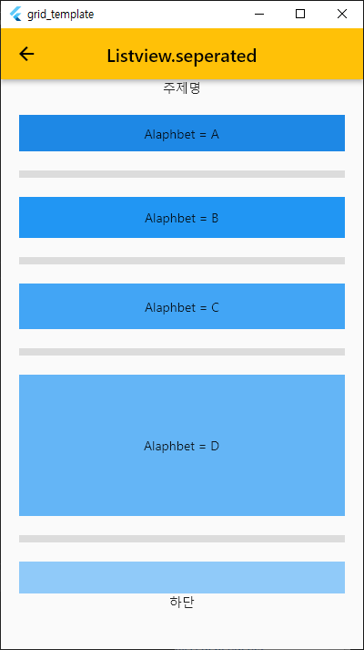

# ListView
    //----------------------------------------------------------------------------------------------
    //* ListView
    //1. 참고 URL : https://doitddo.tistory.com/113
    //2. ListView 4가지 생성 방법
    //   - ListView
    //   - ListView.builder
    //   - ListView.separated
    //   - ListView.custom
    //3. ListView
    //   - 명시적으로 ListView의 생성자를 호출하고 children을 전달하는 방법이다.
    //4. ListView.builder
    //   - builder를 사용하여 임의의 데이터에 대한 ListView를 구성하는 방법이다.
    //5. ListView.separated
    //   - 번에 아이템을 구분하는 구분자(Divider or Separator)를 제공하는 방법을 더한 것이다.
    //9. ListView와 GridView 차이점
    //   - ListView는 화면기준 한라인에 자료한건이 표시된다.
    //   - GridView는 화면기준 하란인에 자료를 여러건 표시 할 수 있다.
    //----------------------------------------------------------------------------------------------

    
### > listview_seperated_100 
 