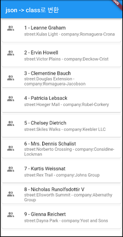

# json

## 1. json 관련 URL
1. JSON을 다른 language(dart,java등) class로 만들어주기  : https://app.quicktype.io/ : 
2. Json-REST API Call Server용 해주기 (mockaroo.com)    : https://mockaroo.com
3. Json-REST API Call Server용 해주기(typicode)         : https://jsonplaceholder.typicode.com
4. json샘플 데이터 : Json 데이터: https://jsonplaceholder.typicode.com/users
5. QuickType 사이트: https://app.quicktype.io/

## 2. 교육자료
 1. 영상 : https://www.youtube.com/watch?v=bQN8LP3CR20&list=PLQt_pzi-LLfoOpp3b-pnnLXgYpiFEftLB&index=39
 2. GitHub : https://github.com/icodingchef/json_app_lec

## 3. 실행화면
 