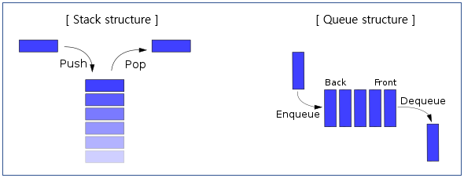
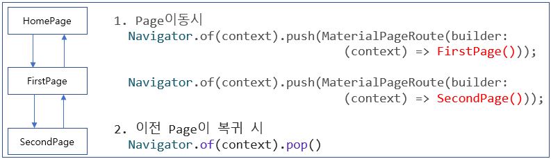
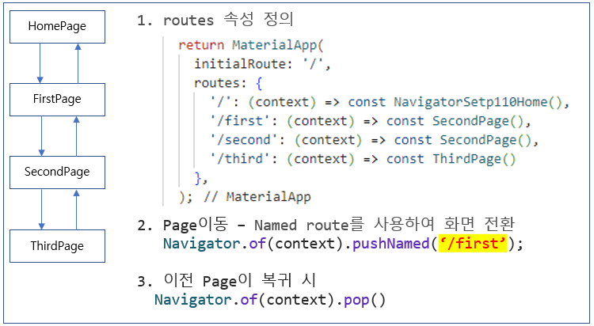

### 소스코드 오류
   - 8-2 (todo_list프로젝트)
   - subDetail.dart 

# 1. 선행학습
 - Stack, Queue 구조


# 2. Navigator Step 100
 - Navigator : push, pop 기본
 - [ [소스](./lib/navigator_step100/navigator_step100.dart) ]


1. Navigator는 스택(stack)을 이용해 페이지를 관리할 때 사용하는 클래스 이다.   
2. of(context) 함수는 현재 페이지를 나타낸다.   
3. push() 함수는 스택에 페이지를 쌓는 역할을 한다.   
4. push()함수에 전달한 MaterialPageRoute()함수는 머터리얼 스타일로 페이지를 이동하게 해준다.   
   - 페이지 이동시 animation효과   
   - 다음페이지 appbar에 뒤로가기 버튼 생성하기   
5. pop() 함수는 스택 메모리에서 맨 위에 있는 페이지를 제거한다.

 ```dart
   Navigator.of(context).push(MaterialPageRoute(builder: (context) => NavigatorStep100()));
   1. MaterialPageRoute() : 특정페이지를 생성 후 Route기능을 이용해 머터리얼 스타일로 페이지 이동
   2. Navigator.of(context).push : stack에 특정페이지를 추가
```

# 3. Navigator Step 110
 - Navigator : Routes, pushNamed, pop 기본
 - [ [소스](./lib/navigator_step100/navigator_step110_routes.dart) ]
 - Route(라우터)는 통신에서 이동 경로를 의미하는 용어이다.   
   네트워크 프로그래밍에서는 요청 URL을 해석해 정해진 경로로 이동하는 기능을 라우트라고 한다.   
   이러한 라우트 기능을 이용하면 페이지 이동 기능을 좀 더 편리하게 구현할 수 있다.   



```dart
 - 특징
   . routes기능사용은 MaterialApp Widget내부에서만 정의가 가능하다.
   . home 속성 대신 initialRoute 속성을 기술한다.
   . initialRoute : MateriaApp Widget생성 시 default로 보여줄 page를 기술한다. (home:속성 이라고 봐도 된다.)
   . home속성과 initialRoute 속성 2개 동시에 사용시 error발생
```
# 4. Navigator Step 200
 - Navigator : Arguments 전달, Arguments 받기, Return값 넘기기, Return값 받기    
 - [ [소스](./lib/navigator_step100/navigator_step200_arguments.dart) ]
### 1. Arguments 전달 - 방법 1
 - routes + pushNamed 를 이용한 Arguments 전달
```dart
   onTap: () async {
      Map<String, String> todoOne = {'subject':'Fltter 공부하기', 'flag':'NO'};
      var rtnValue = await Navigator.of(context).pushNamed('/todoPage', arguments: todoOne);
      subject = rtnValue.toString();
   },
```
### 2. Arguments 받기
```dart
   class _NavigatorStep200Todo extends State<NavigatorStep200Todo> {
      @override
      Widget build(BuildContext context) {
         final Map<String, String> todo = ModalRoute.of(context)!.settings.arguments as Map<String, String>;
      }
   }
```

### 3. Return값 넘기기
 - pop method definition : `void pop<T extends Object?>([ T? result ])`    
   - generic type으로 정의 되어 있기 때문에 어떤 type이건 모두 Return 가능하다.  
   - Return받을 때는 반드시 형변환을 해야 된다.
```dart
   Navigator.of(context).pop('YES');
```

### 3. Return값 받기
```dart
   onTap: () async {
      Map<String, String> todoOne = {'subject':'Fltter 공부하기', 'flag':'NO'};
      var rtnValue = await Navigator.of(context).pushNamed('/todoPage', arguments: todoOne);
      
      //뒤로가기버튼 클릭으로   null및 공백이 return될 수 있기 때문에 필수 확인 필요
      if (rtnValue != null && todoList[index]["flag"] != rtnValue) {
         setState(() {
            subject = rtnValue.toString();
         })      
   },
```

### 4. Arguments 전달 - 방법 2
 - push + settings를 이용한 Arguments 전달
 - Page전환
```dart
   onPressed: () async {
      //settings 속성을 이용한 argument전달 (현재 todo 갯수 넘기기)
      var subject = await Navigator.of(context).push(
         MaterialPageRoute(
            builder: (_) => NavigatorStep200Add(),
            settings: RouteSettings(arguments: todoList.length),
         ),
      );
      if (subject != null && subject != '') {
      setState(() {
         todoList.add({"subject": subject.toString(), "flag": "NO"});
      });
      }
   },

```
# 5. Navigator Push
 - dart소스는 없고 아래 설명만 존재
 - route_two_screen.dart 소스보고 추가 개발 및 수정 필요
 - Push종류
 1. Navigator.of(context).push(route)    
 2. Navigator.of(context).pushNamed(routeName)    
 3. Navigator.of(context).pushAndRemoveUntil(newRoute, (route) => false)    
 4. Navigator.of(context).pushNamedAndRemoveUntil(newRouteName, (route) => false)    
 5. Navigator.of(context).pushReplacement(newRoute)    
 6. Navigator.of(context).pushReplacementNamed(routeName)    
 7. Navigator.of(context).popAndPushNamed(routeName)    

### 1. Navigator.of(context).push(route)  
 - 위쪽에서 설명
### 2. Navigator.of(context).pushNamed(routeName) 
 - 위쪽에서 설명
### 3. Navigator.of(context).pushAndRemoveUntil(newRoute, (route) => false)  
 - 일반 Route 방식
```dart
   ElevatedButton(
      onPressed: () {
         Navigator.of(context).pushAndRemoveUntil(
            MaterialPageRoute(builder: (_) => const RouteThreeScreen()),
            (route) => route.settings.name == '/'
            //(route) => false or true
         );
      },
      child: const Text('페이지 이동 (push And Remove Until)')),
```
 1. (route) => false
    - 다음화면으로 같을 경우 Appbar에 뒤로가기 버튼이 없다.
    - 이유는 뒤로가는 route가 다 지워졌기 때문이다. (stack에서 삭제)
    - 그래서 RouteThreeScreen()화면에서 pop을 하면 검은화면이 뜬다.
 2. (route) => true
    - 모든 route가 다 살아있고(stack 유지), 다음화면으로이동 한다.
 3. (route) => route.settings.name == '/'
    - 모든 routes 정보(stack목록)를 for문과 같은 방식으로 순환한다.
    - 조건절의 결과가 true이면 route정보를 살리고
    - 조건절의 결과가 fals이면 route정보를 삭제한다.
    - '/'(Route Home 화면)만 살아 있고, 다른 route정보는 삭제 된다.
    - RouteThreeScreen()이동 후     
      pop을 하면 Route Home Screen화면으로 이동 된다.

 - 추가 예문
 - 테스트 필요 ???
```dart
   Navigator.of(context).pushAndRemoveUntil(
      MaterialPageRoute(builder: (BuildContext context) =>HomePage()),
      (route) => false
   );
```
 - stack에서 route정보를 삭제하고 HomePage()화면으로 이동하면서 HomePage()는 stack에 넣는다.

### 4. Navigator.of(context).pushNamedAndRemoveUntil(newRouteName, (route) => false) 
 - Named Route(명명된 라우트, 이름 지정 라우트) 방식일 경우
 - pushAndRemoveUntil 과 방식만 다르지 작동방법은 모두 동일하다.
 - 테스트 필요 ???
```dart
  Navigator.of(context).pushNamedAndRemoveUntil(context, '/', (route) => false);
```

### 5. Navigator.of(context).pushReplacement(newRoute)   
 - 일반 Route 방식
 - 테스트 필요 ???
```dart
 Navigator.of(context).pushReplacement(
   MaterialPageRoute(builder: (_) => const ToDoList()));
```
 - 현재 페이지를 stack에서 Pop하고, ToDoList() 화면으로 이동하고, stack에 push한다.

### 6. Navigator.of(context).pushReplacementNamed(routeName)
 - Named Route(명명된 라우트, 이름 지정 라우트) 방식일 경우
 - pushReplacement 과 방식만 다르지 작동방법은 모두 동일하다.
 - 테스트 필요 ???
```dart
 Navigator.of(context).pushReplacementNamed('/screen2');
```

### 7. Navigator.of(context).popAndPushNamed(routeName)
 - pushReplacementNamed와 popAndPushNamed의 결과는 동일하다.
 - 다른점
   . 페이지 전환 과정이 조금 다르다.
   . popAndPushNamed 메서드는 stack에서 pop하고, 지정한 화면을 push 한다.
   . pushRelacementNamed 메서드는 현재 페이지와 stack의 맨 위의 페이지가 대체 된다.
   . 눈으로 확인 방법은 : slow motion 을 켜두고 확인하면 페이지 변경(전환)시 애니메이션 차이가 보인다.

# 6. Navigator Pop
 - [ [소스](./lib/pop_100/PopScreen100.dart) ]

### 1. Pop 정의
 1. syntax : `Navigator.of(context).pop('YES');`   
 2. pop() method에 argument를 넣어 이전 페이지(화면)에 전달 할 수 있다.
 3. 현재 페이지(화면)를 stack에서 꺼내고, 이전 페이지(화면)로 이동한다.   

### 2. Pop의 종류
 1. `Navigator.of(context).pop();`   
 2. `Navigator.of(context).maybePop();`   
 3. `Navigator.of(context).canPop();`   

### 3. Navigator.of(context).pop();
 1. pop() method에 argument를 넣어 이전 페이지(화면)에 전달 할 수 있다.
 2. 현재 페이지(화면)를 stack에서 꺼내고, 이전 페이지(화면)로 이동한다.   
 3. 만약, 이전 페이지가 존재 하지 않는다면 앱은 검은색 화면이 보여진다.   

### 4. Navigator.of(context).maybePop();
 1. 현재 Pop가능한 상태인 경우에만 pop이 실행됨
 2. stack에 페이지가 한개(현재 페이지)만 존재 하는 경우에는 pop()을 수행하지 않는다.
 3. 이전 페이지가 존재 하는 경우에만 pop()을 수행한다.
```dart
   ElevatedButton(
      onPressed: () { Navigator.of(context).maybePop(); },
      child: const Text('뒤로가기'),
   ),
```

### 5. Navigator.of(context).canPop();
 - 정의
 1. 현재 Pop가능 상태인지 여부를 return한다.    
 2. return값은 true/false이다.    
 3. true: stack에 페이지가 2개(현재 페이지 + 이전페이지)가 존재 하면 true를 return한다.    
 4. false : stack에 페이지가 1개(현재 페이지)만 존재 하면 false를 return한다.    
 5. 예문 : 아래 [ WillPopScope Widget ] 챕터에서 설명 및 예문 존재   

### 6. WillPopScope Widget
 - 정의
 1. Scaffold를 WillPopScope Widget을 Wrap한 후 onWillPop: 속성에 업무로직을 구현한다.
 2. onWillPop: 속성   
    . 특정한 화면에서 일정시간 유지해야 하는 경우에 사용된다.    
    . onWillPop: 속성 값에 따라서 pop()을 수행 시 아래와 같이 동작한다.   
      - onWillPop: 속성에 -> false를 return하면 stack에서 pop()하지 못한다. (안한다?)
      - onWillPop: 속성에 -> true를 return하면 stack에서 pop()을 수행한다.

```dart
  ...
  .. 타이머 로직 구현
  Widget build(BuildContext context) {
    return WillPopScope(
      onWillPop: () async {
        if (타이머 시간 < 10초) {
         return false;
        } else {
         return true;
        }
      },
      child: Scaffold(...),
   )
  }
```

 3. Home 화면(첫화면)에서    
    사용자가 폰 하단bar의 뒤로가기 버튼을 눌렀을때 이동하지 않고 현재화면에 유지시키고 싶을 경우에 사용된다.    
```dart
  Widget build(BuildContext context) {
    return WillPopScope(
      onWillPop: () async {
        var canPop = Navigator.of(context).canPop();
        return canPop;
      },
      child: Scaffold(...),
   )
  }
```


# 7. Routes Type
### 1. 일반 Route방식   
 - [ [소스] (./routes_step100/routes_step100.dart)]
    `Navigator.of(context).push(MaterialPageRoute(builder: (context) => FirstPage()));'

### 2. 별도 Model class를 만들어 사용
 - [ [소스] (./routes_step100/routes_step110.dart)]
 1. Model 구성
 ```dart
   //메뉴를 구성할 모델
   class RoutesStep110ScreenModel {
   final WidgetBuilder builder;
   final String name;

   RoutesStep110ScreenModel({
      required this.builder,
      required this.name,
   });
   }

   final routesStep100Screens = [
   RoutesStep110ScreenModel(builder: (_) => RoutesStep110First(), name: 'First Page'),
   RoutesStep110ScreenModel(builder: (_) => RoutesStep110Second(), name: 'Second Page'),
   RoutesStep110ScreenModel(builder: (_) => RoutesStep110Third(), name: 'Third Page'),
];
 ```
 2. AppBar Drawer 에 메뉴 목록 만들기
```dart
   drawer: Drawer(
      child: ListView(
         children: [
            routesStep100Screens.map((screen) => _DrawerMenu(name: screen.name, builder: screen.builder)),
         ],
      )
   )
   //-----------------------------------------------------
   class _DrawerMenu extends StatelessWidget {
      final String name;
      final WidgetBuilder builder;

      const _DrawerMenu({required this.name, required this.builder, super.key});

      @override
      Widget build(BuildContext context) {
         return ListTile(
            tileColor: Colors.white, //기본 메뉴 tile배경색
            onTap: () { Navigator.of(context).push(MaterialPageRoute(builder: builder)); },
            title: Text(name),
         );
      }   
   }
```

### 3. Named Routes
 - [ [소스] (./routes_step200_named/named_routes200.dart)]
 1. Named Route class정의하기
```dart
   class RouteName {
   static const home = "/";
   static const firstPage = "/firstPage";
   static const secondPage = "/secondPage";
   static const thirdPage = "/thirdPage";
   }

   class PageName {
   static const home = "홈";
   static const firstPage = "첫번째 페이지";
   static const secondPage = "두번째 페이지";
   static const thirdPage = "세번째 페이지";
   }

   var namedRoutes200 = <String, WidgetBuilder>{
   RouteName.home: (context) => const NamedRoutes200Home(),
   RouteName.firstPage: (context) => const NamedRoutes200First(),
   RouteName.secondPage: (context) => const NamedRoutes200Second(),
   RouteName.thirdPage: (context) => const NamedRoutes200Third(),
   };
```

 2. routes 속성 정의하기
```dart
    return MaterialApp(
      initialRoute: RouteName.home,
      routes: namedRoutes200,
    );
```

 3. AppBar Drawer 에 메뉴 목록 만들기
```dart
   drawer: Drawer(
      child: ListView(
         children: [
            for (var element in namedRoutes200.entries) 
                  _NamedDrawerMenu(name: element.key, builder: element.value)
         ],
      ),
   ),
```

### 4. AutoRouter
 - 공부 합시다.