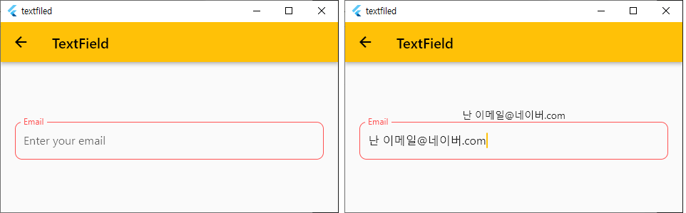
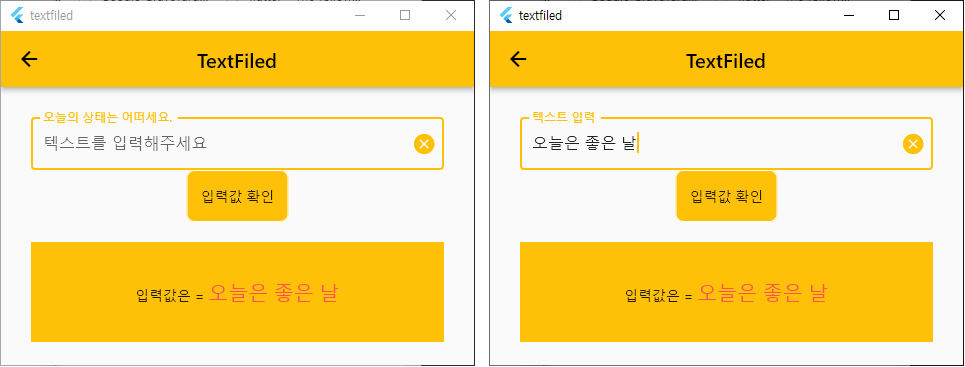
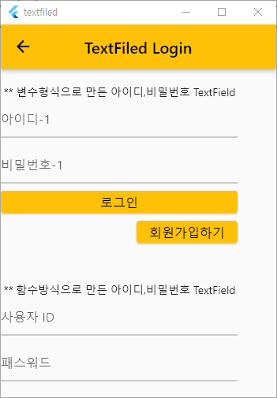

# TextField

## 1. TextField 정의
 - Flutter에서 사용자의 입력을 받기 위해서는 Textfield 위젯을 사용한다.

  

## 2. TextField Event 및 속성
 - onChanged : 사용자가 textfield에 글자를 입력하면 변화가 발생하여 onChanged callback을 호출
 - onSubmitted : 사용자가 입력이 완료되어 enter를 누르면 onSubmitted callback을 호출

## 3. 예제 - textfield_090.dart
 - controller를 사용하지 않고 값 제어하기
 - member 변수(String inputText)를 하나 생성해서 이 member를 이용해서 값을 제어 한다.

	

## 3. 예제 - textfield_100.dart
 - controller를 사용하여 값 제어하기

	

## 3. 예제 - textfield_110_login.dart
 - controller를 사용하여 값 제어하기
 - 변수형식으로 만든 id, pw TextField
 - 함수방식으로 만든 id, pw TextField

	


## 4. TextField 기본문법 - textfield_090.dart
```dart
String inputText = '';

TextField(
    onChanged: (text) {
        setState(() {
            inputText = text;  //<--inputText member 변수를 이용해서 TextField값 제어
        });
    },
    decoration: const InputDecoration(
        labelText: 'Email',
        hintText: 'Enter your email',
        labelStyle: TextStyle(color: Colors.redAccent),

        focusedBorder: OutlineInputBorder( ...... ),
        enabledBorder: OutlineInputBorder( ...... ),
        border: OutlineInputBorder( ...... ),
    ),
    keyboardType: TextInputType.emailAddress,
    ),
```

## 4. TextField 기본문법 - textfield_100.dart
```dart
final TextEditingController _textController = TextEditingController();
......
TextField(
    controller: _textController,
    //------------------------------------------------------------------------
    // onSubmitted : textfield에서 enter key를 누르면 발생되는 event
    //------------------------------------------------------------------------
    onSubmitted: (text) {
    sendMsg(text);
    },
    //------------------------------------------------------------------------
    // onChanged : 값이 변경 시 발생되는 event
    //             suffixIcon 을 클릭 후 값이 clear된 경우에는 onChanged 호출 안됨
    //------------------------------------------------------------------------
    onChanged: (text) {
    checkText(text);
    },
    //------------------------------------------------------------------------
    // decoration
    //   - labelText : Box 좌상단에 보여주는 label
    //   - hintText  : 값이 미 존재 시 보여주는 hint
    // border
    //   - default값은 Box line이 없이 밑줄만 보여짐
    //   - OutlineInputBorder() : Box line 4곳 모두 보여짐
    // suffixIcon
    //   - Box 오른쪽에 X icon늘 보여준다.
    //   - X icon click시 값을 지워준다.
    //------------------------------------------------------------------------
    decoration: InputDecoration(
    labelText: '오늘의 상태는 어떠세요.',
    hintText: '텍스트를 입력해주세요',
    border: const OutlineInputBorder(),
    suffixIcon: _textController.text.isNotEmpty
        // ignore: avoid_unnecessary_containers
        ? Container(
            child: IconButton(
                onPressed: () {
                _textController.clear();
                //setState를 해줘야 되는지 잘 모르겠음
                //없어서 화면에서는 지워짐.
                //setState(() {});
                },
                icon: const Icon(Icons.cancel),
            ),
            )
        : null,
    ),
)
```


## 4. TextField 기본문법 - textfield_110_login.dart
```dart
    //------------------------------------------------------------------------
    //변수방식으로 아이디 TextField 생성하기
    //------------------------------------------------------------------------
    var _idTextField = TextField(
        controller: _idTextEditController_1,
        decoration: const InputDecoration(
        hintText: "아이디-1",
        labelStyle: TextStyle(fontSize: 16, color: Colors.amber),
        focusedBorder: OutlineInputBorder(
            borderRadius: BorderRadius.all(Radius.circular(10.0)),
            borderSide: BorderSide(width: 1, color: Colors.redAccent),
        ),
        ),
        onChanged: (text) {
        setState(() {});
        },
    );

  //------------------------------------------------------------------------
  // @class 사용자id, 패스워드용 TextField 만들기
  //------------------------------------------------------------------------
  TextField makeLoginTextField(String name) {
    return TextField(
      controller: _idTextEditController_2,
      obscureText: true,
      decoration: InputDecoration(
        hintText: name,
        labelStyle: const TextStyle(fontSize: 16, color: Colors.amber),
        focusedBorder: const OutlineInputBorder(
          borderRadius: BorderRadius.all(Radius.circular(10.0)),
          borderSide: BorderSide(width: 1, color: Colors.redAccent),
        ),
      ),
      onChanged: (text) {
        setState(() {});
      },
    );
  }    
```

## 9. InputDecoration Border
 - textfield의 Border를 디자인 하기 위해서는 InputDecoration widget을 사용한다.

```dart
    //onload시점에 Border 디자인
    border: OutlineInputBorder( ...... ),

    //focuse가 위치 된 경우 Border 디자인
    focusedBorder: OutlineInputBorder( ...... ),

    //
    enabledBorder: OutlineInputBorder( ...... ),

    //
    errorBorder: OutlineInputBorder( ...... ),
```
